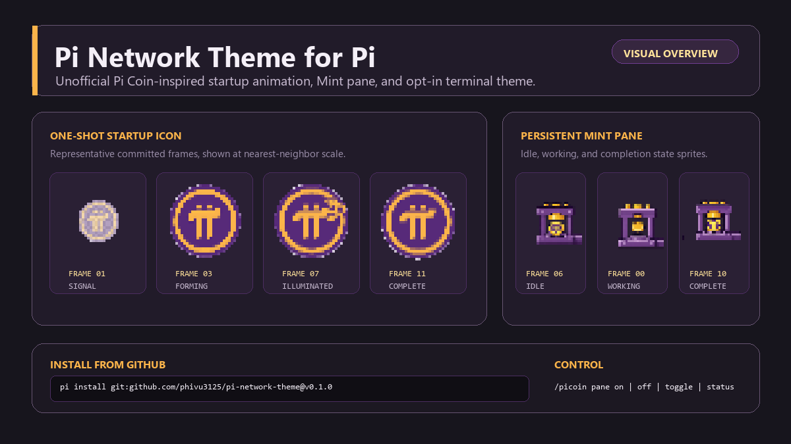

# Pi Network Theme for Pi

An unofficial Pi Coin-inspired startup animation, persistent Mint pane, and optional dark theme for the [Pi coding agent](https://github.com/earendil-works/pi).



> **Unofficial community package.** This project is not affiliated with, endorsed by, sponsored by, or an official product of Pi Network or the Pi coding agent project. The Pi Network logo is used with permission, as stated by the package creator; Pi Network names, marks, and artwork remain the property of their respective owner. See [Third-party notices](./THIRD_PARTY_NOTICES.md).

## Features

- One-shot Pi coin startup icon animation that holds on its final frame.
- Persistent, UI-only Pi Mint pane above the editor; it does not create a transcript or model-context message.
- Idle, working, success, error, and completion visual states for the Mint pane.
- Purple/gold working indicator and a responsive narrow-terminal fallback.
- Opt-in `pi-coin` dark theme; the extension never changes the selected theme automatically.

## Install from GitHub

Install the tagged public release:

```sh
pi install git:github.com/phivu3125/pi-network-theme@v0.1.0
```

For a local checkout during development:

```sh
git clone https://github.com/phivu3125/pi-network-theme.git
cd pi-network-theme
npm ci
pi -e .
```

Review third-party Pi packages before installing: extensions execute with your system permissions. This package is **not published to npm yet**; no npm install command is provided until that changes.

## Use

The Mint pane is enabled by default. Its local commands do not invoke the model:

```text
/picoin pane on
/picoin pane off
/picoin pane toggle
/picoin pane status
```

`off` removes the pane and stops its timers while leaving the startup header, theme, and working indicator available. `status` reports the current setting and its config path.

The only persisted setting is stored at `~/.pi/agent/pi-network-theme.json`:

```json
{ "paneEnabled": true }
```

To use the optional theme, open `/settings`, choose the theme setting, and select **`pi-coin`**. You can switch back at any time.

## Compatibility and package behavior

The artwork uses Unicode vertical half-block cells, truecolor ANSI colors, and a Unicode-capable monospace font. It is designed for a dark-background current Windows Terminal, iTerm2, Kitty, WezTerm, or VS Code integrated terminal. Pi approximates the optional theme on older 256-color terminals.

At runtime the package makes no network calls or telemetry requests. It reads only the documented local config file, persists only `paneEnabled`, does not modify providers, models, prompts, tools, messages, transcripts, or the system prompt, and imports only committed static art, Node.js filesystem/path built-ins, and Pi extension/TUI APIs.

The release allowlist includes the extension, generated art, `pi-coin` theme, `assets/demo.png`, `assets/preview.png`, and release documents. Source sheets, normalized frame inputs, generator scripts, tests, `node_modules`, and WebAssembly are repository-only and are not distributed in the package tarball.

## Development

Requires Node.js 22.19.0+ and Pi 0.82.1.

```sh
npm ci
npm run generate:art
npm run preview:art -- startup
npm run preview:art -- mint
npm test
npm run typecheck
npm pack --dry-run
```

<details>
<summary>Art generation and renderer details</summary>

The generator reads two repository-only sources. `assets/source/pi-icon-pixel-contact-sheet.png` supplies the 12 startup cells; each cell is cleaned for its baked checkerboard using a four-connected edge flood over near-neutral bright pixels, then nearest-neighbor reduced to committed 30×30 RGBA frames in `assets/frames/startup-icon/`. `assets/source/pi-pixel-contact-sheet.png` supplies the 12 Mint cells; fixed source boundaries are normalized directly to native 28×28 RGBA frames in `assets/frames/minting/`. Source image footers are excluded in both cases.

Both sequences use the committed direct pixel renderer, not Chafa matrix preprocessing, dithering, or symbol selection. Startup and Mint art are paired into terminal cells with `▀`, `▄`, `█`, or space. Compact variants use deterministic centered-nearest resizing. Pixels below alpha 80/255 are transparent; remaining pixels are mapped by weighted RGB distance to the eight-color Pi palette. SGR state changes are minimized and every line resets foreground/background colors.

Generation is deterministic: `generated/pi-network-art.ts` is committed, Mint idle references completed frame 06 without duplicated frame data, and CI checks drift for generated art and normalized startup frames. `chafa-wasm` 0.3.3 is development-only PNG decoding support and is never initialized at Pi runtime.

</details>

## License and notices

Package code is available under the [MIT License](./LICENSE). Third-party attribution and the logo notice are in [THIRD_PARTY_NOTICES.md](./THIRD_PARTY_NOTICES.md).
